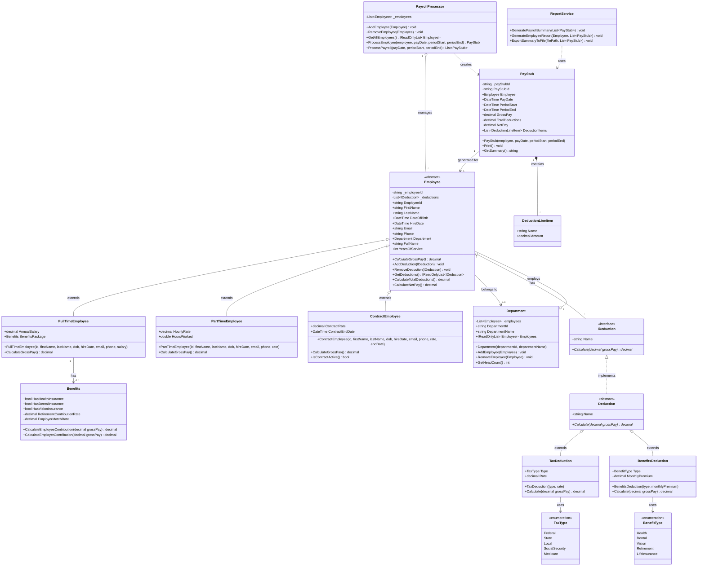

# Payroll System — Class Diagram

## UML Class Diagram (Mermaid)

---

## Class Descriptions & Relationships

### Core Model Classes

| Class | Type | Purpose |
|-------|------|---------|
| `Employee` | Abstract | Base class for all employee types. Encapsulates shared identity data and deduction management. |
| `FullTimeEmployee` | Concrete | Salaried employee paid on a bi-weekly basis (AnnualSalary ÷ 26). Eligible for a `Benefits` package. |
| `PartTimeEmployee` | Concrete | Hourly employee; gross pay = `HourlyRate × HoursWorked`. |
| `ContractEmployee` | Concrete | Fixed-fee contractor paid a flat `ContractRate` per pay period with a defined end date. |
| `Department` | Concrete | Groups employees; tracks head-count. |
| `Benefits` | Concrete | Describes employer-sponsored benefit elections and contribution rates. |
| `PayStub` | Concrete | Immutable snapshot of a single employee's pay calculation for one period. |
| `DeductionLineItem` | Concrete (DTO) | A name-value pair capturing a single deduction line on a pay stub. |

### Deduction Hierarchy

| Class | Type | Purpose |
|-------|------|---------|
| `IDeduction` | Interface | Contract for any deduction: exposes `Name` and `Calculate(grossPay)`. |
| `Deduction` | Abstract | Base class implementing `IDeduction`; reduces boilerplate for concrete deductions. |
| `TaxDeduction` | Concrete | Percentage-based deduction (Federal, State, Local, Social Security, Medicare). |
| `BenefitsDeduction` | Concrete | Fixed monthly-premium deduction split across pay periods (Health, Dental, Vision, etc.). |

### Service Classes

| Class | Purpose |
|-------|---------|
| `PayrollProcessor` | Orchestrates payroll: iterates employees, calculates pay/deductions, produces `PayStub` list. |
| `ReportService` | Formats and outputs payroll summaries and per-employee earnings reports. |

---

## OOP Principles Applied

### Encapsulation
- `Employee` stores its deduction list in a `private` field and exposes it only through controlled public methods (`AddDeduction`, `GetDeductions`).  
- Sensitive pay fields on `PayStub` (gross, net) are set only at construction time via `init`-style setters, preventing post-creation mutation.  
- `EmployeeId` is read-only after construction.

### Inheritance
- `Employee` defines the common interface (`CalculateGrossPay()` abstract) and shared implementation (`CalculateNetPay()`, `CalculateTotalDeductions()`), eliminating code duplication across the three employee types.  
- `Deduction` provides a concrete base for tax and benefits deductions; only `Calculate()` must be overridden.

### Polymorphism
- `PayrollProcessor.ProcessPayroll()` holds a `List<Employee>` and calls `CalculateGrossPay()` on each without knowing the concrete type — each subclass provides its own implementation at runtime.  
- Any new deduction type can be slotted in by implementing `IDeduction` without changing `Employee` or `PayrollProcessor`.

### Abstraction
- `IDeduction` abstracts *what* a deduction does (produce an amount from gross pay) from *how* it is calculated.  
- `Employee` abstracts the concept of "a person who gets paid" without prescribing the pay calculation.

---

## Relationship Summary

| Relationship | Description |
|---|---|
| `Employee` → `Department` | Many-to-one association; an employee belongs to one department. |
| `Employee` ◇→ `IDeduction` | Aggregation; an employee owns zero or more deductions. |
| `FullTimeEmployee` → `Benefits` | Association; full-time employees may have a benefits package. |
| `Department` ◇→ `Employee` | Aggregation; a department contains many employees. |
| `PayStub` ♦→ `DeductionLineItem` | Composition; line items exist only within their pay stub. |
| `PayrollProcessor` ◇→ `Employee` | Aggregation; the processor manages the employee roster. |
| `PayrollProcessor` ⟶ `PayStub` | Dependency; the processor creates pay stubs. |
| `ReportService` ⟶ `PayStub` | Dependency; the report service reads pay stubs to produce output. |
